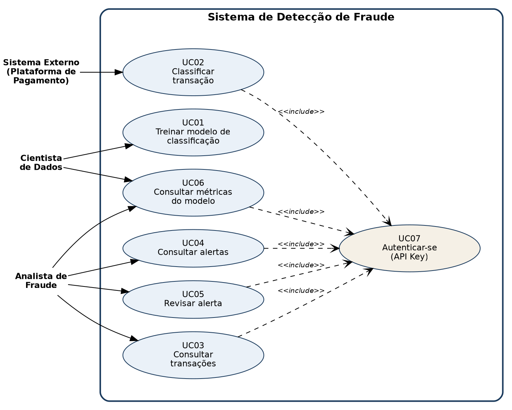

# DOCUMENTO DE ESPECIFICAÇÃO DE SOFTWARE

## Sistema de Detecção de Fraude em Transações Financeiras

*Documento de especificação de software apresentado como parte do
Trabalho de Conclusão de Curso (TCC) em Engenharia, sob orientação do
Prof. Nelson Aguiar.*

---

> **NOTA DE ACOMPANHAMENTO (remover antes da entrega final)**
> Este documento está sendo construído de forma incremental, seguindo
> o cronograma de entregas definido pelo professor. Capítulos ainda
> não desenvolvidos aparecem marcados como "A DESENVOLVER". A
> formatação ABNT completa (capa, folha de rosto, sumário com número
> de página, resumo/abstract) deve ser aplicada ao final, usando como
> referência o modelo de documentação fornecido pelo professor.

---

# 1 INTRODUÇÃO

## 1.1 Contextualização

O avanço da digitalização dos meios de pagamento transformou
radicalmente a forma como transações financeiras são realizadas no
Brasil. A popularização de métodos como o Pix, o crescimento do
comércio eletrônico e a expansão de fintechs e instituições de
pagamento digital ampliaram o acesso da população a serviços
financeiros, mas também abriram espaço para o crescimento acelerado de
fraudes financeiras. Esse cenário exige, cada vez mais, soluções
tecnológicas capazes de identificar comportamentos fraudulentos de
forma rápida, precisa e escalável.

Dados recentes evidenciam a dimensão do problema. Segundo levantamento
da Quod, com base no Registro Unificado de Fraudes (Rufra), o Brasil
registrou mais de 9 milhões de indícios de fraudes financeiras apenas
no primeiro semestre de 2026, um crescimento de 10,26% em relação ao
segundo semestre de 2025. Nesse período, contas correntes estiveram
envolvidas em 94% dos indícios registrados, celulares em 78%, e o Pix
figurou como o meio de pagamento utilizado em 85% dos casos. A
engenharia social respondeu por 40% dos golpes, tendo vitimado cerca
de 3,1 milhões de pessoas (AGÊNCIA BRASIL, 2026).

No campo mais restrito das fraudes em cartão de crédito e comércio
eletrônico — recorte de maior relevância para o presente trabalho — o
cenário é igualmente preocupante. O prejuízo estimado com fraudes em
compras online por cartão de crédito saltou de R$ 3,9 bilhões em 2020
para R$ 7,8 bilhões em 2025, com projeção de R$ 8,1 bilhões para 2026
(BAND, 2026). Em levantamento anterior, de aproximadamente 280 milhões
de transações de cartão realizadas em ambiente de e-commerce, 3,7
milhões (1,4% do total) foram identificadas como tentativas
fraudulentas, resultando em perdas da ordem de R$ 3,5 bilhões
(PAGBRASIL, 2024). No mesmo sentido, a Serasa Experian registrou
6.937.832 tentativas de fraude no primeiro semestre de 2025 — um
crescimento de 29,5% em relação ao mesmo período do ano anterior
(SINCOMAVI; SERASA EXPERIAN, 2025).

Vale destacar que parte desse crescimento nos números de fraudes
reportadas não decorre exclusivamente do aumento da atividade
criminosa, mas também do aprimoramento dos mecanismos de detecção e do
maior compartilhamento de dados entre instituições financeiras,
impulsionado, entre outros fatores, pela Resolução nº 501 do Banco
Central do Brasil (AGÊNCIA BRASIL, 2026). Essa constatação reforça,
paradoxalmente, a importância de sistemas de detecção cada vez mais
eficazes: à medida que a infraestrutura de identificação de fraudes
evolui, cresce também a necessidade de ferramentas capazes de
processar grandes volumes de dados e identificar padrões sutis de
comportamento fraudulento em tempo hábil.

Soma-se a esse cenário um desafio técnico relevante: bases de dados de
transações financeiras são, por natureza, altamente desbalanceadas — o
número de transações fraudulentas representa uma fração ínfima do
total de transações legítimas. Esse desbalanceamento compromete o
desempenho de algoritmos de classificação tradicionais, que tendem a
favorecer a classe majoritária e, consequentemente, a não identificar
corretamente os casos de fraude, que é justamente o objetivo central
de um sistema antifraude.

## 1.2 Justificativa

Apesar da disponibilidade de soluções antifraude no mercado, essas
ferramentas costumam ser acessíveis principalmente a grandes
instituições financeiras, que dispõem de orçamento e infraestrutura
tecnológica para implementá-las. Pequenas fintechs e varejistas
digitais, por outro lado, frequentemente carecem de mecanismos
acessíveis e eficazes para identificar transações fraudulentas em
tempo real, ficando mais expostos a prejuízos financeiros diretos e a
danos à confiança de seus clientes.

Diante desse contexto, o presente trabalho parte do seguinte cenário:

**Problema:** pequenas fintechs e empresas de comércio eletrônico
possuem dificuldade em identificar, de forma acessível e em tempo
real, transações financeiras fraudulentas, o que resulta em prejuízos
financeiros e perda de confiança dos consumidores.

**Solução proposta:** o desenvolvimento de um sistema inteligente
capaz de analisar transações financeiras e classificá-las
automaticamente quanto ao risco de fraude, utilizando algoritmos de
Machine Learning — especificamente Regressão Logística, Árvore de
Decisão e Random Forest —, com tratamento adequado do desbalanceamento
de classes, permitindo a comparação de desempenho entre os modelos e a
identificação da abordagem mais eficaz para o contexto proposto.

Diante desse cenário, este trabalho busca responder à seguinte questão
de pesquisa: **qual algoritmo de Machine Learning apresenta melhor
desempenho na detecção de fraudes financeiras em bases de dados
altamente desbalanceadas?**

A relevância deste trabalho se sustenta em três pilares. Primeiro, no
impacto econômico e social crescente das fraudes financeiras no
Brasil, evidenciado pelos dados apresentados na contextualização, que
afetam tanto instituições financeiras quanto milhões de consumidores.
Segundo, na lacuna de ferramentas antifraude acessíveis para pequenas
e médias empresas do setor financeiro e de comércio eletrônico,
público frequentemente desatendido pelas soluções corporativas de
grande porte. Terceiro, na relevância técnico-científica do problema
de classificação em bases desbalanceadas, um desafio amplamente
discutido na literatura de aprendizado de máquina e que exige
comparação empírica entre diferentes abordagens para se chegar a
conclusões consistentes sobre qual estratégia é mais eficaz em
contextos semelhantes.

Do ponto de vista acadêmico, o desenvolvimento deste projeto também se
justifica como oportunidade de aplicação prática de conceitos de
engenharia de requisitos, aprendizado de máquina, arquitetura de
software e gestão ágil de projetos, consolidando a documentação como
artefato central de comunicação entre a equipe de desenvolvimento e as
partes interessadas.

## 1.3 Objetivos

### 1.3.1 Objetivo geral

Desenvolver e avaliar um sistema de classificação de fraudes em
transações financeiras baseado em algoritmos de Machine Learning,
comparando o desempenho de diferentes modelos em um cenário de dados
altamente desbalanceados.

### 1.3.2 Objetivos específicos

- Realizar revisão bibliográfica sobre fraudes financeiras no Brasil,
  técnicas de Machine Learning aplicadas à detecção de fraude e
  métodos de tratamento de desbalanceamento de classes;
- Levantar e descrever os requisitos funcionais e não funcionais do
  sistema;
- Representar, por meio de diagrama de casos de uso, as interações
  entre os atores e o sistema;
- Treinar e comparar os algoritmos de Regressão Logística, Árvore de
  Decisão e Random Forest sobre uma base pública de transações de
  cartão de crédito;
- Aplicar e avaliar técnicas de balanceamento de classes sobre os
  modelos treinados;
- Avaliar o desempenho dos algoritmos por meio de métricas adequadas a
  cenários desbalanceados — precisão, recall, F1-score e AUC-ROC;
- Desenvolver um serviço de inferência que permita a classificação de
  transações em tempo real, com painel de alertas para revisão humana
  dos casos sinalizados como suspeitos;
- Modelar a estrutura estática do sistema por meio de diagrama de
  classes e o comportamento dinâmico de um dos principais fluxos por
  meio de diagrama de sequência;
- Definir a arquitetura de software em camadas e as tecnologias
  associadas a cada camada.

---

# 2 REQUISITOS DO SISTEMA

Este capítulo apresenta o levantamento de requisitos do sistema,
iniciando pela identificação dos atores e casos de uso (Seção 2.1),
seguida da listagem dos requisitos funcionais, priorizados segundo a
classificação MoSCoW (Seção 2.2). O detalhamento dos fluxos de cada
caso de uso e os requisitos não funcionais serão apresentados nas
próximas entregas (ver notas de acompanhamento).

## 2.1 Diagrama de casos de uso

A Figura 1 apresenta o diagrama de casos de uso do sistema, elaborado
segundo a notação UML (Unified Modeling Language). Foram identificados
três atores principais: Sistema Externo (plataforma de pagamento ou
comércio eletrônico que envia transações para análise), Analista de
Fraude (responsável pela revisão manual dos alertas gerados) e
Cientista de Dados (responsável pelo treinamento e acompanhamento do
modelo de Machine Learning).

Figura 1 — Diagrama de casos de uso do sistema

Fonte: elaborado pelos autores (2026)

Todos os casos de uso que expõem dados de transações — UC02 a UC06 —
incluem (`<<include>>`) o caso de uso UC07 (Autenticar-se), já que o
sistema exige autenticação por chave de API para acesso a qualquer
dado sensível, conforme requisito não funcional de segurança (a ser
detalhado na Seção 2.4).

### 2.1.1 Descrição resumida dos atores

| Ator | Descrição |
|---|---|
| Sistema Externo (Plataforma de Pagamento) | Sistema automatizado (ex.: plataforma de e-commerce ou fintech) que envia os dados de uma transação para classificação em tempo real via API. |
| Analista de Fraude | Profissional responsável por consultar os alertas gerados pelo sistema, revisar manualmente cada caso e classificá-lo como "fraude confirmada" ou "falso positivo". |
| Cientista de Dados | Responsável por treinar e comparar os modelos de classificação, avaliando suas métricas de desempenho antes de colocá-los em produção. |

### 2.1.2 Descrição resumida dos casos de uso

| ID | Caso de uso | Ator(es) principal(is) |
|---|---|---|
| UC01 | Treinar modelo de classificação | Cientista de Dados |
| UC02 | Classificar transação | Sistema Externo |
| UC03 | Consultar transações | Analista de Fraude |
| UC04 | Consultar alertas | Analista de Fraude |
| UC05 | Revisar alerta | Analista de Fraude |
| UC06 | Consultar métricas do modelo | Analista de Fraude, Cientista de Dados |
| UC07 | Autenticar-se (API Key) | (incluído pelos demais casos de uso) |

## 2.2 Requisitos funcionais

Os requisitos funcionais (RF) descrevem as funcionalidades que o
sistema deve disponibilizar. A coluna "Prioridade" segue a
classificação MoSCoW (Essencial, Importante, Desejável), utilizada
para orientar o planejamento das sprints (Capítulo 3).

| ID | Descrição | Caso de uso | Prioridade |
|---|---|---|---|
| RF01 | O sistema deve treinar o modelo de classificação a partir do dataset público, persistindo o modelo treinado (ex: .pkl) de forma versionada. | UC01 | Essencial |
| RF02 | O sistema deve expor um endpoint `POST /transacoes/classificar` que recebe os atributos de uma transação e retorna score de risco e classe prevista. | UC02 | Essencial |
| RF03 | O sistema deve armazenar toda transação classificada com seu score, classe prevista e timestamp no banco de dados. | UC02 | Essencial |
| RF04 | O sistema deve listar no painel as transações com score acima de um limiar configurável (ex: 0,7) como "alerta". | UC04 | Essencial |
| RF05 | O sistema deve permitir que o analista marque um alerta como "fraude confirmada" ou "falso positivo". | UC05 | Essencial |
| RF06 | O sistema deve calcular e exibir métricas do modelo (precisão, recall, F1, matriz de confusão) e volume de alertas por dia. | UC06 | Importante |
| RF07 | O sistema deve permitir filtrar transações/alertas por intervalo de datas, valor mínimo/máximo e status de revisão. | UC03, UC04 | Importante |

*Observação sobre a priorização:* os requisitos RF01 a RF05 foram
classificados como Essenciais por constituírem o fluxo mínimo
necessário para que o sistema cumpra seu propósito central — treinar
um modelo, classificar transações em tempo real e permitir a triagem
manual dos alertas. Os requisitos RF06 e RF07 foram classificados como
Importantes: agregam valor significativo à operação do sistema
(transparência sobre o desempenho do modelo e capacidade de
investigação), mas o sistema já seria funcionalmente utilizável sem
eles, caso houvesse restrição severa de tempo de desenvolvimento.
Nenhum requisito do escopo oficial do tema foi classificado como
Desejável, dado o escopo já enxuto definido pelo catálogo de temas do
professor orientador; a categoria é mantida na tabela por consistência
com a metodologia MoSCoW e poderá ser usada para requisitos evolutivos
identificados ao longo do desenvolvimento (ex.: painel visual com
gráficos adicionais).

---

*A DESENVOLVER nas próximas entregas:*
- *Seção 2.3 — Detalhamento dos fluxos de cada caso de uso (fluxo
  principal, fluxos alternativos, sub-fluxos e exceções), seguindo o
  mesmo padrão do modelo de referência.*
- *Seção 2.4 — Requisitos não funcionais, categorizados conforme
  ISO/IEC 25010 (entrega prevista: 20/09/2026).*

---

# 3 METODOLOGIA ÁGIL E GESTÃO DO PROJETO

*A DESENVOLVER — entrega prevista: 16/09/2026*

---

# 4 MODELAGEM DO SISTEMA

*A DESENVOLVER — entrega prevista: 27/09/2026 (diagrama de classes) e
03/10/2026 (diagrama de sequência)*

---

# 5 ARQUITETURA DO SISTEMA

*A DESENVOLVER — entrega prevista: 03/10/2026*

---

# 6 CONSIDERAÇÕES FINAIS

*A DESENVOLVER*

---

# REFERÊNCIAS

AGÊNCIA BRASIL. **Com novas regras do BC, registros de fraudes
financeiras crescem 10%**. Rio de Janeiro, 2026. Disponível em:
https://agenciabrasil.ebc.com.br/economia/noticia/2026-07/com-novas-regras-do-bc-registros-de-fraudes-financeiras-crescem-10.
Acesso em: 27 ago. 2026.

BAND. **Fraudes no e-commerce devem superar R$ 8,1 bilhões no Brasil
em 2026**. São Paulo, 2026. Disponível em:
https://www.band.com.br/economia/noticias/fraudes-no-e-commerce-devem-superar-r-81-bilhoes-no-brasil-em-2026-202608101353.
Acesso em: 27 ago. 2026.

METRÓPOLES. **Serasa identificou 743 mil tentativas de golpes on-line
no 1º semestre**. Brasília, 2026. Disponível em:
https://www.metropoles.com/brasil/serasa-identificou-743-mil-tentativas-de-golpes-on-line-no-1semestre.
Acesso em: 27 ago. 2026.

PAGBRASIL. **Tipos de fraude com cartão de crédito em e-commerces**.
2024. Disponível em:
https://www.pagbrasil.com/pt-br/blog/fraude/tipos-de-fraude-com-cartao-de-credito-em-e-commerces/.
Acesso em: 27 ago. 2026.

SINDICATO DO COMÉRCIO VAREJISTA DE MINAS GERAIS (SINCOMAVI); SERASA
EXPERIAN. **Tentativas de fraude batem recorde no primeiro semestre de
2025**. 2025. Disponível em: https://sincomavi.org.br/?p=14584. Acesso
em: 27 ago. 2026.

*Observação: as referências acima são majoritariamente fontes
jornalísticas/institucionais, adequadas para contextualizar o problema
na Introdução. O Referencial Teórico (a desenvolver) deve ser
complementado com artigos acadêmicos revisados por pares (Google
Scholar, SciELO, IEEE Xplore) sobre detecção de fraude e Machine
Learning, além das referências técnicas padrão de Engenharia de
Software e Metodologia Científica exigidas pelo template ABNT do ATCC.*
